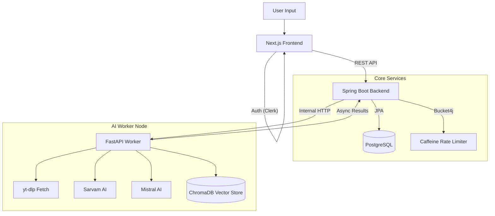

# 🎬 AI Video Assistant (Enterprise Grade)


An intelligent, microservice-based video analysis and Q&A application. Feed it a YouTube URL or a local media file, and it automatically processes, transcribes, and summarizes the content using advanced LLMs. Includes a built-in RAG (Retrieval-Augmented Generation) engine to converse directly with your video.

## ✨ Key Features (CV Highlights)

- **"Try Before You Buy" Hybrid Auth:** Implemented a seamless guest-to-authenticated flow. Users can process videos anonymously, and upon signing up (via Clerk), an atomic database update instantly "claims" and links their anonymous session history to their new account.
- **Microservices Architecture:** Scalable separation of concerns. A lightweight **Spring Boot** API gateway handles auth, sessions, and rate-limiting, while delegating heavy AI processing (transcription/embeddings) to an internal **FastAPI** Python worker.
- **Enterprise Rate Limiting:** Built with `Bucket4j` and `Caffeine` cache in Spring Boot. Enforces distinct API limits (e.g., 10 reqs/hr for guests, 50 reqs/hr for logged-in users) preventing abuse and memory leaks.
- **Multi-lingual AI Pipeline:** Supports English and Hinglish utilizing Sarvam AI (Speech-to-Text) and Mistral AI for smart summarization (Titles, TL;DR, Key Takeaways).
- **RAG Chat Engine:** Chat directly with your video. Powered by ChromaDB and LangChain to fetch relevant context and answer specific questions instantly.
- **Premium UI/UX:** Stunning dark-themed, responsive Next.js frontend utilizing glassmorphism, dynamic progress trackers, and real-time polling.

## 🏗️ System Architecture



## 🚀 Getting Started

### Prerequisites
- Java 21+ and Maven
- Python 3.10+
- Node.js 18+
- PostgreSQL Database
- API Keys: Mistral AI, Sarvam AI, Clerk

### 1. Database Setup
Ensure PostgreSQL is running and create a database:
```sql
CREATE DATABASE ai_video_assistant;
```

### 2. Spring Boot Backend
```bash
cd spring-boot-backend
# Configure src/main/resources/application.properties with DB credentials
./mvnw spring-boot:run
```
*Runs on `http://localhost:8080`*

### 3. Python AI Worker (FastAPI)
```bash
cd core
pip install -r Requirements.txt
# Create .env file with MISTRAL_API_KEY and SARVAM_API_KEY
python server.py
```
*Runs on `http://localhost:8000`*

### 4. Next.js Frontend
```bash
cd frontend
npm install
# Add NEXT_PUBLIC_CLERK_PUBLISHABLE_KEY and NEXT_PUBLIC_API_URL to .env.local
npm run dev
```
*Runs on `http://localhost:3000`*

## 🛠️ Tech Stack
- **Frontend:** Next.js (App Router), React, Clerk Auth
- **Backend (API):** Java, Spring Boot, Spring Data JPA, Bucket4j
- **Backend (AI):** Python, FastAPI, LangChain, ChromaDB
- **Database:** PostgreSQL
- **Models:** Mistral AI (`ministral-8b-2512`), Sarvam AI
