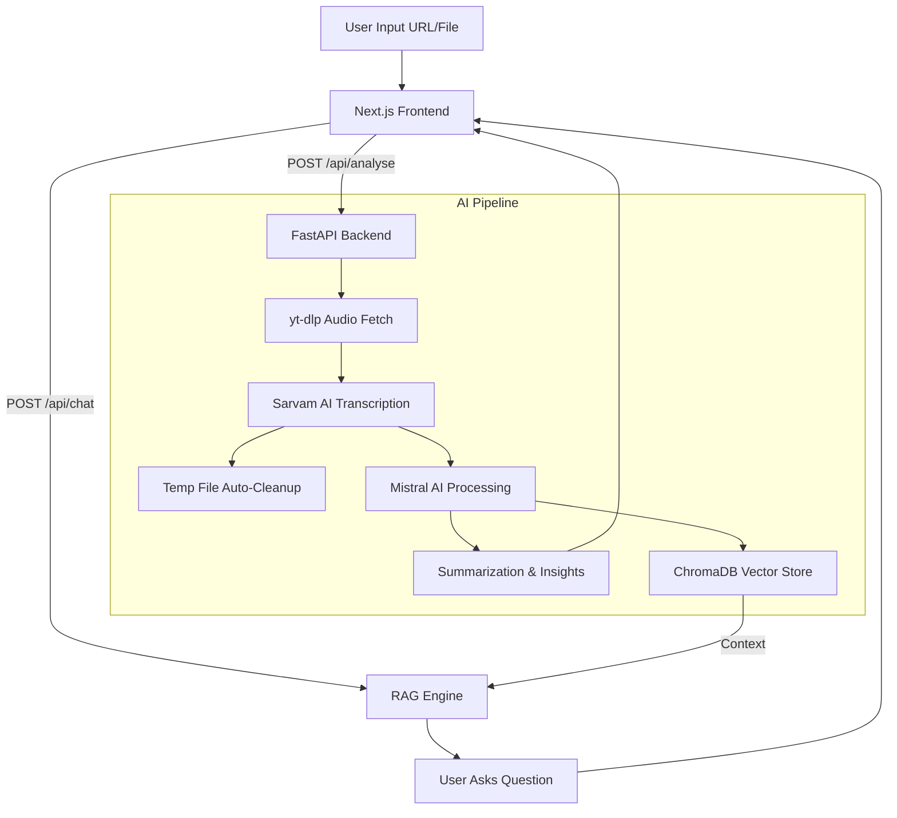

# 🎬 AI Video Assistant


An intelligent, end-to-end meeting and video analysis application. Feed it a YouTube URL or a local audio/video file, and it automatically processes, transcribes, and summarizes the content using advanced LLMs. Includes a built-in Retrieval-Augmented Generation (RAG) chat interface to converse directly with your meeting transcripts.

## ✨ Features

- **Multi-lingual Transcription:** Supports English and Hinglish (using Sarvam AI for seamless translation + transcription).
- **Automated Insights Extraction:** Automatically generates:
  - Smart session titles
  - Bulleted summaries
  - Key decisions made
  - Action items (who needs to do what)
  - Unresolved/open questions
- **RAG Chat Engine:** Chat directly with your video/meeting. Powered by ChromaDB and LangChain to fetch relevant context and answer specific questions.
- **Modern UI:** Built with a stunning dark-themed, responsive Next.js frontend utilizing glassmorphism and real-time pipeline status updates.
- **Production-Ready Backend:** Robust FastAPI implementation featuring intelligent disk-space management (auto-cleanup of temporary audio/video files post-processing) and rate-limit handling for high-tier LLMs (up to 625k TPM).

## 🏗️ Architecture



## 🚀 Getting Started

### Prerequisites
- Python 3.10+
- Node.js 18+
- API Keys for Mistral AI and Sarvam AI.

### 1. Backend Setup (FastAPI)
```bash
# Clone the repository
git clone https://github.com/your-username/AI-Video-Assistant.git
cd AI-Video-Assistant

# Install dependencies
pip install -r Requirements.txt

# Create .env file and add your API keys
echo "MISTRAL_API_KEY=your_key_here" > .env
echo "SARVAM_API_KEY=your_key_here" >> .env

# Run the backend server
python server.py
```
*Backend runs on `http://localhost:8000`*

### 2. Frontend Setup (Next.js)
```bash
# Open a new terminal and navigate to the frontend folder
cd frontend

# Install packages
npm install

# Run the development server
npm run dev
```
*Frontend runs on `http://localhost:3000`*

## 🛠️ Tech Stack
- **Frontend:** Next.js (App Router), React, Vanilla CSS (Custom Design System)
- **Backend:** FastAPI, Python, Uvicorn
- **AI/ML:** LangChain, ChromaDB, HuggingFace Embeddings
- **Models:** Mistral AI (`ministral-8b-2512`), Sarvam AI (Speech-to-Text)
- **Utilities:** `yt-dlp` (Media extraction), `pydub` (Audio chunking)
